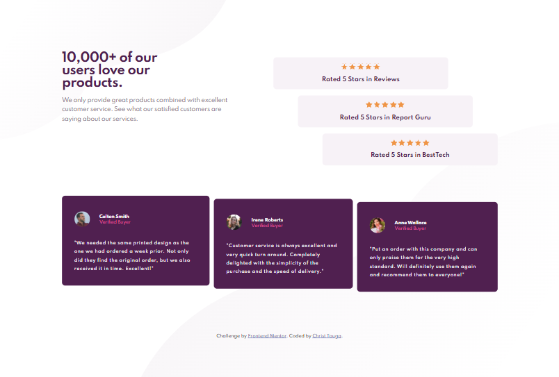

# Frontend Mentor - Social proof section solution

This is a solution to the [Social proof section challenge on Frontend Mentor](https://www.frontendmentor.io/challenges/social-proof-section-6e0qTv_bA).  

## Table of contents

- [Overview](#overview)
  - [The challenge](#the-challenge)
  - [Screenshot](#screenshot)
  - [Links](#links)
- [My process](#my-process)
  - [Built with](#built-with)
  - [What I learned](#what-i-learned)
  - [Continued development](#continued-development)
  - [Useful resources](#useful-resources)
- [Author](#author)
- [Acknowledgments](#acknowledgments)


## Overview

### The challenge

Users should be able to:

- View the optimal layout for the section depending on their device's screen size

### Screenshot



### Links

- Solution URL: [GitHub URL](https://github.com/Christ-Kevin/social-proof-section-master.git)
- Live Site URL: [live site URL](https://christ-kevin.github.io/social-proof-section-master/)

## My process

### Built with

- Semantic HTML5 markup
- CSS custom properties
- Flexbox
- Mobile-first workflow
- [Styled Components](https://styled-components.com/) - For styles

### What I learned

This was the biggest project I worked on so far. I just learned how to improve my workflow and my proble solving skills

```html
<ul class="testimony">
            <li>
                <div class="split">
                    <div></div>
                    <div>
                        <p class="person">Colton Smith</p>
                        <p class="buyer">Verified Buyer</p>
                    </div>
                </div>

                <p class="description">"We needed the same printed design as the one we had ordered a week prior. Not only did they find the original order, but we also received it in time. Excellent!"</p>
            </li>
....
....
....
</ul>
```
```css
.rating::before {
    content: '';
    width: 100px;
    height: 1rem;
    margin: 0 auto 1rem auto;

    display: block;
    background: url(../images/icon-star.svg);
    background-repeat: space;
}


gap: 1em;
```

### Continued development

Improve the workflow and the problem solving skills. Solve a problem in a project using Grid

### Useful resources

- [resource 1](https://www.youtube.com/watch?v=PY_iIeAKFw0&t=2392s) - This helped me to know how to use Figma and how to think to solve the challenge. This Video gives a better presentation of what should be done in this challenge
- [resource 2](https://www.youtube.com/watch?v=K27WULzr2P8&t=4984s) - This helped me to know how to use .svg icons als background images of a block container

## Author

- Website - [Christ-Kevin](https://github.com/Christ-Kevin/social-proof-section-master.git)
- LinkedIn - [Christ-Kevin](https://www.linkedin.com/in/christ-k%C3%A9vin-touga-watat-32026712a?lipi=urn%3Ali%3Apage%3Ad_flagship3_profile_view_base_contact_details%3BwIwjoW5hQAWiDiOGdsvWrQ%3D%3D)
- Frontend Mentor - [@Christ-Kevin](https://www.frontendmentor.io/profile/Christ-Kevin)
- Twitter - [@WatatK](https://www.twitter.com/WatatK)

## Acknowledgments

Special thanks to [kevin-powell](https://youtube.com/kevinpowell) and to [Matt Studdert](https://www.linkedin.com/in/matthewstuddert) for their youtube videos that inspired me in building this project
